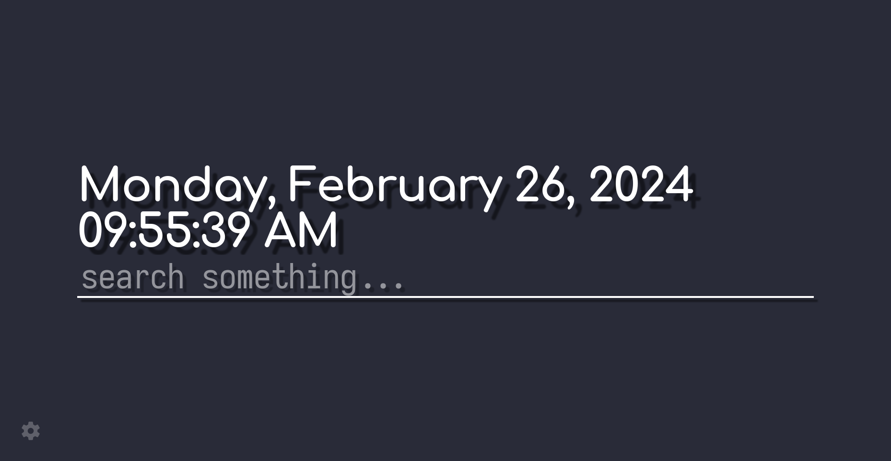

# Katei

Highly customizable and minimal Firefox start page build with [svelte](https://svelte.dev/) and [sveltekit](https://kit.svelte.dev).

## Installation
 - Download from the `.xpi` file from [releases](https://github.com/ixora-0/katei/releases/)
 - Drag the file into any open Firefox window to install it (select **Add** when you see the prompt).
 - Alternatively, enter `about:addons` in the url bar, go to **Extensions**, select the gear button and choose **Install Add-on From File**, then select the downloaded file.

## Roadmap
 - [ ] Settings menu enhancements
     - [ ] Tooltip for configuration options
     - [ ] Customizable fonts
 - [ ] Add color theme presets
 - [ ] Add weather widget
 - [ ] Add stock market watch widget

## Building from source
Requirements
```
bun: >= 1.1.4
```

1. Run `bun install`
2. Run `bun run build`. Code is built in `./build`.
3. Run `web-ext build -s build`. Code is packaged to `./web-ext-artifacts`.

## Developing
### Prerequisites
Install [bun](https://bun.sh/).
Or, use [nix-shell](https://nixos.wiki/wiki/Development_environment_with_nix-shell) for an ephemeral development shell. You can use the default bash shell:
```sh
$ nix develop
```
Or specify your preffered shell:
```sh
$ nix develop -c zsh
```
You can also install [nix-direnv](https://github.com/nix-community/nix-direnv#installation) to automatically switch shells when you `cd` into the project.

### Running
 - First run;
```sh
$ bun install
```
 - Then run the following command to start a development build:
```sh
$ bun run dev
```
